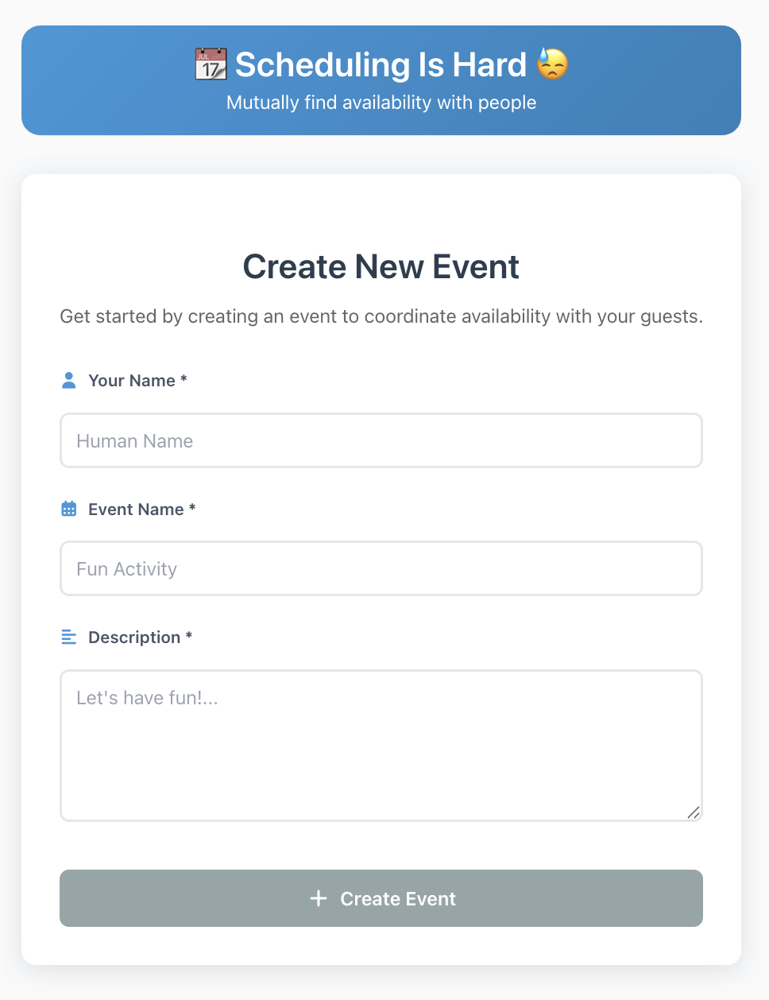
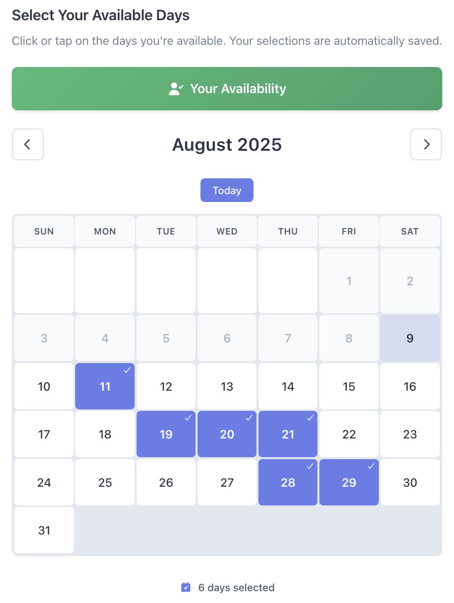
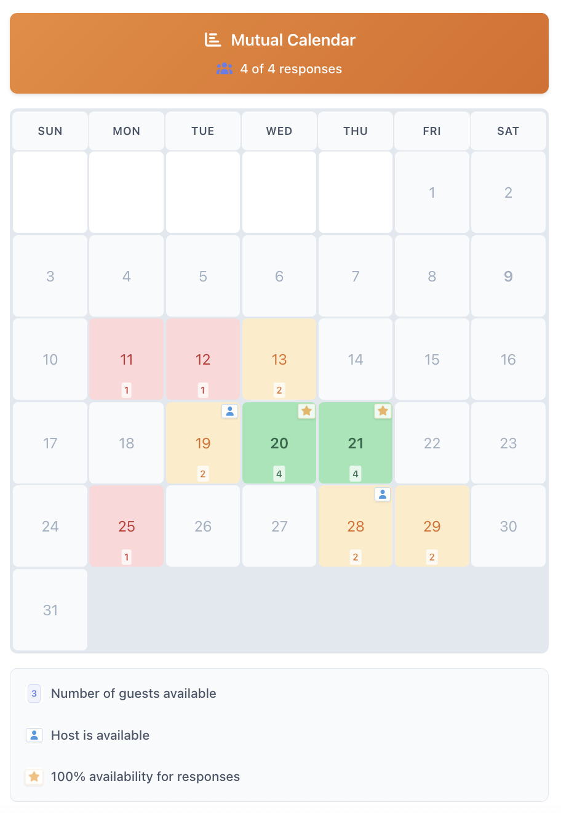
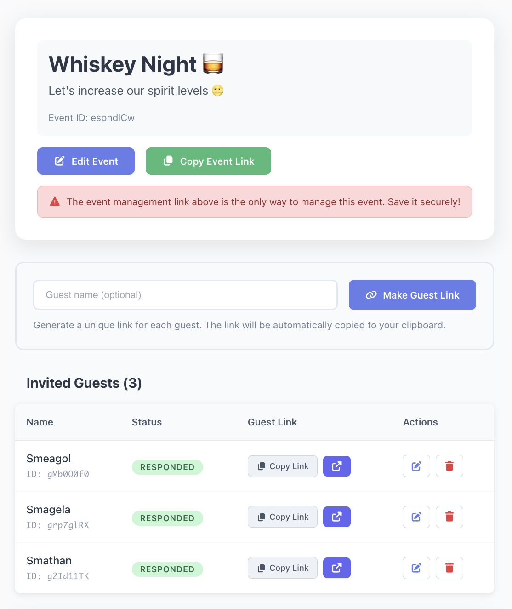

# Scheduling Is Hard

Mutually find availability with any number of people. Try it out at https://scheduling-is-hard.com or deploy it yourself for free:

> This app uses [Cloudflare Turnstile](https://www.cloudflare.com/turnstile/) and by default uses testing keys. Update the environment variables to use your own keys.

Scheduling with friends is hard. This app is designed to get mutual availability for any number of people, quickly. A host can create an event and then create as many unique links as they want to send out to guests. Invited guests submit their availability and a calendar heatmap of availability is displayed to everyone.

### Create events

### Add availability

### See mutual availability

### Manage guests

## Authentication Flow

This application uses a JWT-based authentication system. Since it's zero login, authentication just verifies the user is not a bot with Cloudflare Turnstile. Once Turnstile verification passes, a JWT is generated and used as the bearer token for API requests.

### How it works

1. **Turnstile Verification**: When the frontend loads, Cloudflare Turnstile presents a challenge to verify the user is human
2. **JWT Exchange**: Once Turnstile provides a token, the frontend calls `/api/auth/verify` with the Turnstile token
3. **JWT Generation**: The server validates the Turnstile token and returns a JWT that expires in 24 hours
4. **API Authentication**: All subsequent API requests use the JWT in the `Authorization: Bearer <token>` header
5. **Token Refresh**: When the JWT expires, the process repeats (Turnstile challenge → JWT exchange)

### Frontend Implementation

- **JWT Storage**: JWTs are stored in session storage
- **Turnstile Widget**: Only renders when no valid JWT exists or when the JWT is expired (24 hours)
- **API Requests**: All API calls (except `/auth/verify`) include the JWT in the Authorization header
- **Expiration Handling**: Frontend checks JWT expiration before making requests and handles 401 responses

## Docs

- [API](./schemas/api.yaml)
- [Requirements](./REQUIREMENTS.md)
- [Architecture](./ARCHITECTURE.md)

## Dev

Create a `.env` file copied from `.env.staging` or `.env.production`.

| Command | Description |
|---------|-----------|
| `npm run dev` | **Start development server** - Most commonly used for local development |
| `npm run deploy-preview` | **Deploy to Cloudflare** - Push your changes to a new version on staging |
| `npm run deploy-staging` | **Deploy to Cloudflare** - Push your changes to staging |
| `npm run deploy-production` | **Deploy to Cloudflare** - Push your changes to production |
| `npm run test` | **Run tests** - Run tests using Vitest |
| `npm run build` | **Build for production** - Compile TypeScript, bundle assets, and generate API docs |
| `npm run check` | **Pre-deployment validation** - Verify code compiles and deployment readiness |
| `npm run lint` | **Format code** - Auto-format source code with Prettier |
| `npm run preview` | **Preview built app** - Test the production build locally |
| `npm run generate-types` | **Generate TypeScript types** - Run when OpenAPI schema is modified |
| `npm run cf-typegen` | **Generate Worker types** - Run when new Cloudflare bindings are added |
| `npm run lint-openapi` | **Validate OpenAPI schema** - Check API documentation for errors |
| `npm run preview-openapi` | **Preview API docs** - View OpenAPI documentation in browser |

## Workers Builds

To set up PR previews on staging (creates new versions and branch preview urls on the staging Worker while keeping the production Worker's versions clean), these build settings were set up in the Cloudflare Workers dashboard:

### Staging

- Branch: main
- Build command: (blank)
- Enable non-production branch builds: Unchecked
- Deploy command: npm run deploy-staging
- Non-production branch deploy command: npm run deploy-preview
- Variables:
  - VITE_JWT_SECRET_KEY
  - VITE_CF_TURNSTILE_SITE_KEY
  - VITE_CF_TURNSTILE_SECRET_KEY

### Production

- Branch: main
- Build command: (blank)
- Enable non-production branch builds: Unchecked
- Deploy command: npm run deploy-production
- Variables:
  - VITE_JWT_SECRET_KEY
  - VITE_CF_TURNSTILE_SITE_KEY
  - VITE_CF_TURNSTILE_SECRET_KEY

Unfortunately, durable objects are currently not supported in preview branches, so those won't generate.
