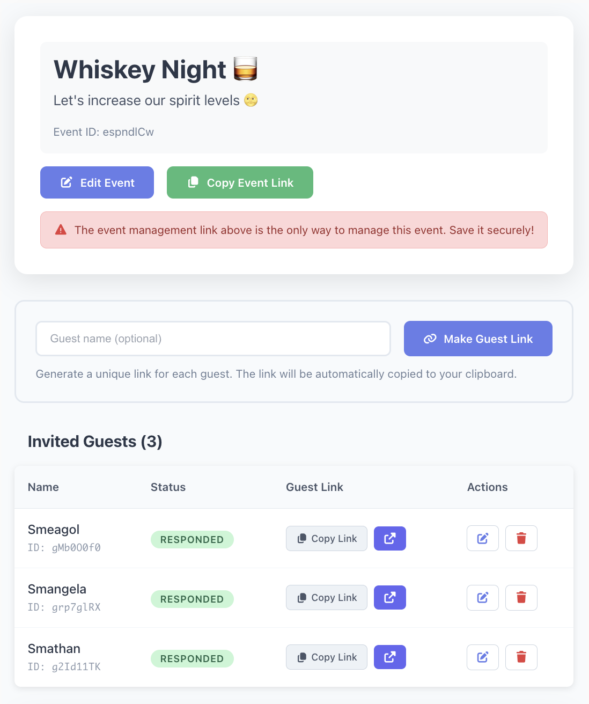

# Scheduling Is Hard

Mutually find availability with any number of people.

Scheduling with friends is hard. This app is designed to get mutual availability for any number of people, quickly. A host can create an event and then create as many unique links as they want to send out to guests. Invited guests submit their availability and a calendar heatmap of availability is displayed to everyone.

### Create events

### Add availability

### See mutual availability

### Manage guests

## Docs

- [API](./schemas/api.yaml)
- [Requirements](./REQUIREMENTS.md)
- [Architecture](./ARCHITECTURE.md)

## Dev

| Command | Description |
|---------|-----------|
| `npm run dev` | **Start development server** - Most commonly used for local development |
| `npm run deploy` | **Deploy to Cloudflare** - Push your changes to production |
| `npm run build` | **Build for production** - Compile TypeScript, bundle assets, and generate API docs |
| `npm run check` | **Pre-deployment validation** - Verify code compiles and deployment readiness |
| `npm run lint` | **Format code** - Auto-format source code with Prettier |
| `npm run preview` | **Preview built app** - Test the production build locally |
| `npm run generate-types` | **Generate TypeScript types** - Run when OpenAPI schema is modified |
| `npm run cf-typegen` | **Generate Worker types** - Run when new Cloudflare bindings are added |
| `npm run lint-openapi` | **Validate OpenAPI schema** - Check API documentation for errors |
| `npm run preview-openapi` | **Preview API docs** - View OpenAPI documentation in browser |
